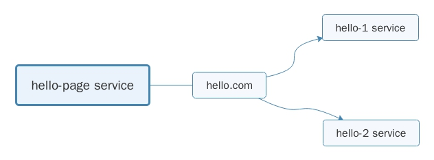

# istio 灰度发布

通过 istio 来进行灰度发布控制。演示案例如下所示。hello-page 通过 hello.com 访问 hello-1 或 hello-2 的服务最终在页面上显示。hello-1 服务返回字符串 "hello 1"，hello-2 服务返回字符串 "hello 2"。



## 演示环境

kubernetes: 1.11
istio: 1.1.0

## 前提条件

hello-page 服务必须注入 istio。

## 配置过程

根据 hello-1 和 hello-2 所在的环境不同，大致可以分为三类: 

  1. hello-1 和 hello-2 没有和 hello-page 部署在同一个 kubernetes 集群中; 
  2. hello-1 和 hello-2 和 hello-page 部署在同一个 kubernetes 集群中，但是没有注入 istio; 
  3. hello-1 和 hello-2 和 hello-page 部署在同一个 kubernetes 集群中，并且都注入了 istio。

其中 2 和 3 的操作是一致的。

#### hello 服务和 hello-page 服务在同一个集群中

首先将 hello-page，hello-1 和 hello-2 部署在不同的命名空间中。

注意: hello-1 和 hello-2 的服务类型不是 NodePort 而是 ClusterIP

```sh
kubectl create ns hello-page
kubectl label ns hello-page istio-injection=enabled
kubectl apply -f yaml/grayscale-release/hello-page.yaml -n hello-page

kubectl create ns hello-1
kubectl apply -f yaml/grayscale-release/hello-1.yaml -n hello-1

kubectl create ns hello-2
kubectl apply -f yaml/grayscale-release/hello-2.yaml -n hello-2
```

##### 百分比分配

执行下面命令，将 90% 的流量分配给 hello-1，10% 的流量分配给 hello-2

```sh
kubectl apply -f yaml/grayscale-release/internal/virtual-service-v2-10.yaml -n hello-page
```

hello-virtual-service.yaml 文件中定义了一个虚拟服务该虚拟服务的 host 是 hello.com 也就是 hello-page 请求 hello 服务的域名，该服务有两个目标主机，分别是位于 hello-1 和 hello-2 命名空间中的 hello 服务，并且设置了连接的端口，接着使用 weight 为 hello-1 和 hello-2 设置流量，如下 hello.hello-1.svc.cluster.local 分配了 90% 的流量，hello.hello-2.svc.cluster.local 分配了 10% 的流量。

```yaml
apiVersion: networking.istio.io/v1alpha3
kind: VirtualService
metadata:
  name: hello-ext-svc
spec:
  hosts:
    - hello.com
  http:
  - route:
    - destination:
        host: hello.hello-1.svc.cluster.local
        port:
          number: 8080
      weight: 90
    - destination:
        host: hello.hello-2.svc.cluster.local
        port:
          number: 8080
      weight: 10
```

##### 按用户分配

使用下面命令，将带有 `user:test` 请求头的流量分配给 hello-1，不带有 `user:test` 请求头的流量分配给 hello-2

```sh
kubectl apply -f yaml/grayscale-release/internal/virtual-service-test-v1.yaml -n hello-page
```

接着通过链接 `http://<cluster-ip>:<hello-page-port>/page?name=test` 访问的所有流量都会流入 hello-1。

istio 对用户身份没有任何特殊的内置机制，可以按照 `user:test` 进行流量分配是因为，hello-page 请求 hello 服务时会携带一个 `user` 请求头，这个请求头的值为 URL 中的查询参数

```java
@GetMapping(path = "/page")
public String helloPage(String name) {
    HttpHeaders header = new HttpHeaders();
    header.add("user", name);
    ResponseEntity<String> entity = restTemplate.exchange("http://" + helloService + ":" + helloPort + "/hello",
            HttpMethod.GET, new HttpEntity<>(header), String.class);
    return entity.getBody();
}
```

而在 `internal/virtual-service-test-v1.yaml` 文件中，将这部分流量发送给 hello-1

```yaml
- route:
- destination:
    host: hello.hello-1.svc.cluster.local
    port:
      number: 8080
match:
- headers:
    user:
      exact: test
```

##### 环境清理

```sh
kubectl delete -f yaml/grayscale-release/internal/virtual-service-test-v1.yaml -n hello-page
kubectl delete -f yaml/grayscale-release/hello-page.yaml -n hello-page
kubectl delete -f yaml/grayscale-release/hello-1.yaml -n hello-1
kubectl delete -f yaml/grayscale-release/hello-2.yaml -n hello-2

kubectl delete ns hello-page
kubectl delete ns hello-1
kubectl delete ns hello-2
```

#### hello 服务为外部服务

首先将 hello-page 服务部署在 istio 环境中，再通过 docker 启动 hello-1 和 hello-2，此时 hello-1 的访问端口为 43990，hello-2 端口为 43991。

```sh
kubectl create ns hello-page
kubectl label ns hello-page istio-injection=enabled
kubectl apply -f yaml/grayscale-release/hello-page.yaml -n hello-page

docker run --name hello-1 -d -p 43990:8080 hello-1:latest
docker run --name hello-2 -d -p 43991:8080 hello-2:latest
```

为了将外部服务注册到 istio 中，需要定义 `ServiceEntry`

```sh
kubectl apply -f yaml/grayscale-release/external/hello-1-serviceEntry.yaml -n hello-page
kubectl apply -f yaml/grayscale-release/external/hello-2-serviceEntry.yaml -n hello-page
```

接着定义一个 `VirtualService` 来进行流量控制，将 90% 的流量分配给 hello-1，将 10% 的流量分配给 hello-2

```sh
kubectl apply -f yaml/grayscale-release/external/virtual-service-v2-10.yaml -n hello-page
```

使用下面命名根据 `user:test` 请求头进行流量控制

```sh
kubectl apply -f yaml/grayscale-release/external/virtual-service-test-v1.yaml -n hello-page
```

##### 环境清理

```sh
kubectl delete -f yaml/grayscale-release/external/hello-1-serviceEntry.yaml -n hello-page
kubectl delete -f yaml/grayscale-release/external/hello-2-serviceEntry.yaml -n hello-page
kubectl delete -f yaml/grayscale-release/external/virtual-service-test-v1.yaml -n hello-page

kubectl delete -f yaml/grayscale-release/hello-page.yaml -n hello-page
kubectl delete ns hello-page

docker rm -f hello-1
docker rm -f hello-2
```

## 附录

src/garyscale-release 目录下为构建 hello-page, hello-1, hello-2 镜像的源码
