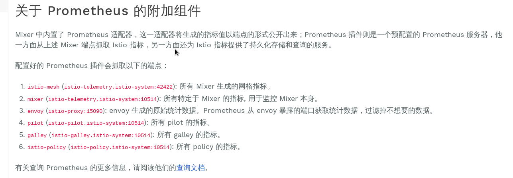

# 使用 Prometheus 收集 istio 指标

配置 Prometheus 收集 istio 指标，文档介绍如何 Prometheus 收集 istio 指标的配置，不包括 Prometheus 如何在 kubernetes 中部署，以及如何将 Prometheus 对应的 ConfigMap 挂载到 Pod

## 操作环境:

istio: 1.1.0
kubernetes: 1.11

## 配置过程

[官方文档](https://istio.io/docs/tasks/telemetry/metrics/querying-metrics/) (官方文档始终为最新版本，与下面内容可能有出入)

官方文档介绍了如何使用内置的 Prometheus 来查询指标，在最下面简单介绍了 Prometheus 如何抓取信息。



根据这段描述，在 istio 的 yaml 文件中可以找到 Prometheus 的配置信息。这里安装的 istio 路径为 install/kubernetes/istio-demo.yaml 因此以这个文件为例。

打开 install/kubernetes/istio-demo.yaml 文件，在文件中搜索 `prometheus.yml` 可以找到 Prometheus 的配置信息。这里一共配置了 12 个任务:

+ istio-mesh
+ envoy-stats
+ istio-policy
+ istio-telemetry
+ pilot
+ galley
+ kubernetes-apiservers
+ kubernetes-nodes
+ kubernetes-cadvisor
+ kubernetes-service-endpoints
+ kubernetes-pods
+ kubernetes-pods-istio-secure

前 6 个任务用于收集 istio 的相关指标（也就是官方文档上抓取的端点），后 6 个任务用于收集 kubernetes 的相关指标。

可以参照 istio 的配置方式，将前面 6 个任务添加到自己的 Prometheus 配置，即可收集指标。

istio 配置的 Prometheus 任务如下

```yaml
    - job_name: 'istio-mesh'
      kubernetes_sd_configs:
      - role: endpoints
        namespaces:
          names:
          - istio-system
      relabel_configs:
      - source_labels: [__meta_kubernetes_service_name, __meta_kubernetes_endpoint_port_name]
        action: keep
        regex: istio-telemetry;prometheus
    - job_name: 'envoy-stats'
      metrics_path: /stats/prometheus
      kubernetes_sd_configs:
      - role: pod
      relabel_configs:
      - source_labels: [__meta_kubernetes_pod_container_port_name]
        action: keep
        regex: '.*-envoy-prom'
      - source_labels: [__address__, __meta_kubernetes_pod_annotation_prometheus_io_port]
        action: replace
        regex: ([^:]+)(?::\d+)?;(\d+)
        replacement: $1:15090
        target_label: __address__
      - action: labelmap
        regex: __meta_kubernetes_pod_label_(.+)
      - source_labels: [__meta_kubernetes_namespace]
        action: replace
        target_label: namespace
      - source_labels: [__meta_kubernetes_pod_name]
        action: replace
        target_label: pod_name
        regex: '(outbound|inbound|prometheus_stats).*'
        action: drop
      - source_labels: [ tcp_prefix ]
        regex: '(outbound|inbound|prometheus_stats).*'
        action: drop
      - source_labels: [ listener_address ]
        regex: '(.+)'
        action: drop
      - source_labels: [ http_conn_manager_listener_prefix ]
        regex: '(.+)'
        action: drop
      - source_labels: [ http_conn_manager_prefix ]
        regex: '(.+)'
        action: drop
      - source_labels: [ __name__ ]
        regex: 'envoy_tls.*'
        action: drop
      - source_labels: [ __name__ ]
        regex: 'envoy_tcp_downstream.*'
        action: drop
      - source_labels: [ __name__ ]
        regex: 'envoy_http_(stats|admin).*'
        action: drop
      - source_labels: [ __name__ ]
        regex: 'envoy_cluster_(lb|retry|bind|internal|max|original).*'
        action: drop
    - job_name: 'istio-policy'
      kubernetes_sd_configs:
      - role: endpoints
        namespaces:
          names:
          - istio-system
      relabel_configs:
      - source_labels: [__meta_kubernetes_service_name, __meta_kubernetes_endpoint_port_name]
        action: keep
        regex: istio-policy;http-monitoring
    - job_name: 'istio-telemetry'
      kubernetes_sd_configs:
      - role: endpoints
        namespaces:
          names:
          - istio-system
      relabel_configs:
      - source_labels: [__meta_kubernetes_service_name, __meta_kubernetes_endpoint_port_name]
        action: keep
        regex: istio-telemetry;http-monitoring
    - job_name: 'pilot'
      kubernetes_sd_configs:
      - role: endpoints
        namespaces:
          names:
          - istio-system
      relabel_configs:
      - source_labels: [__meta_kubernetes_service_name, __meta_kubernetes_endpoint_port_name]
        action: keep
        regex: istio-pilot;http-monitoring
    - job_name: 'galley'
      kubernetes_sd_configs:
      - role: endpoints
        namespaces:
          names:
          - istio-system
      relabel_configs:
      - source_labels: [__meta_kubernetes_service_name, __meta_kubernetes_endpoint_port_name]
        action: keep
        regex: istio-galley;http-monitoring
```
