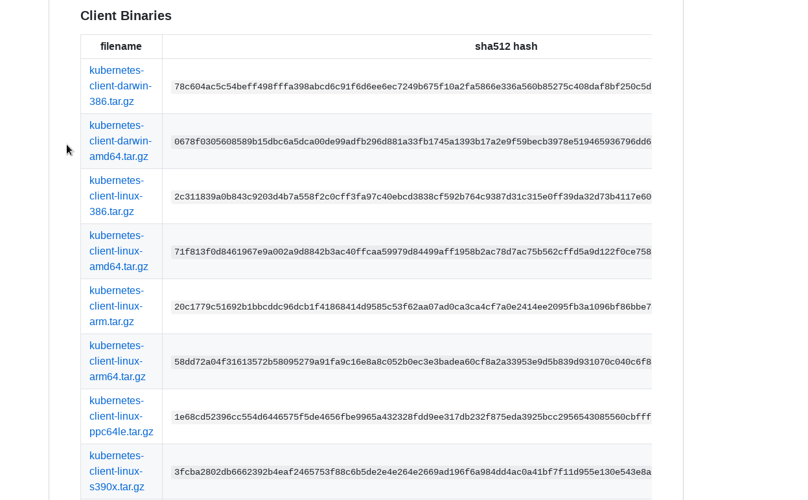

# ubuntu 使用 minikube 搭建 kubernetes 环境

[参考网站](https://yq.aliyun.com/articles/221687)

安装 kubernetes 版本为 1.13

## 安装环境

ubuntu: 18.04

docker: 18.03.1-ce

## 安装步骤

1. 安装 kubectl

    安装官方文档命令安装 kubectl 会被墙，因此直接去 github 上下载对应版本的 kubectl 即可。

    这里要安装的 kubernetes 版本为 1.13，因此选择 [CHANGELOG-1.13.md](https://github.com/kubernetes/kubernetes/blob/master/CHANGELOG-1.13.md) 下载对应的 kubectl。

    

    解压下载之后的文件，将里面的 kubectl 移动到 `/usr/local/bin/kubectl`，并添加可执行权限。

    ```sh
    tar -zxf kubernetes-client-linux-amd64.tar.gz
    chmod +x kubernetes/client/bin/kubectl 
    mv kubernetes/client/bin/kubectl /usr/local/bin/kubectl
    ```

    接着就可以使用 `kubectl version` 查看安装的版本

    [参考网站](https://blog.csdn.net/faryang/article/details/79427573)

2. 安装 kubernetes

    安装好 kubectl 之后就可以使用创建 kubernetes 本地环境

    ```sh
    curl -Lo minikube http://kubernetes.oss-cn-hangzhou.aliyuncs.com/minikube/releases/v0.35.0/minikube-linux-amd64 && chmod +x minikube && sudo mv minikube /usr/local/bin/
    minikube start --vm-driver=none --registry-mirror=https://registry.docker-cn.com
    ```

    这里的 `--vm-driver` 可以选择其他驱动，比如 VirtualBox 或 KVM

    具体可以参考[这里](https://yq.aliyun.com/articles/221687)

    安装完成之后可以通过 `minikube dashboard` 打开 kubernetes 控制台，默认情况下 dashboard 会随机打开一个端口，如果使用虚拟机安装，就需要将 dashboard 的端口暴露出来，才能在虚拟机外访问。

    创建一个新文件 `dashboard-service.yaml`，在新文件中写入下面内容，接着使用命令 `kubectl apply -f dashboard-service.yaml` 来应用文件。执行完毕后可以通过 `<minikube-ip>:30000` 访问 dashboard

    ```yaml
    apiVersion: v1
    kind: Service
    metadata:
      name: kubernetes-dashboard
      namespace: kube-system
      labels:
        k8s-app: kubernetes-dashboard
        kubernetes.io/cluster-service: "true"
        addonmanager.kubernetes.io/mode: Reconcile
    spec:
      type: NodePort
      selector:
        k8s-app: kubernetes-dashboard
      ports:
      - port: 443
        targetPort: 8443
        nodePort: 30000
    ```
