# Kubernetes 与 GPU

+ [安装环境](#安装环境)
+ [前提条件](#前提条件)
+ [安装步骤](#安装步骤)
  - [配置仓库地址](#配置仓库地址)
  - [安装Nvidia显卡驱动](#安装Nvidia显卡驱动)
  - [安装nvidia-docker](#安装nvidia-docker)
    + [卸载nvidia-docker](#卸载nvidia-docker)
  - [安装Kubernetes环境](#安装Kubernetes环境)
    + [初始化环境](#初始化环境)
    + [创建Master节点](#创建Master节点)
    + [安装kubernetes-dashboad](#安装kubernetes-dashboad)
    + [加入集群](#加入集群)
    + [卸载](#卸载)
  - [安装Nvidia插件](#安装Nvidia插件)
  - [运行tensorflow](#运行tensorflow)
+ [参考文章](#参考文章)

在 Kubernetes 环境上使用 GPU 运行 tensorflow。要安装的 kubernetes 版本为 1.14.1

## 安装环境

debian 9

docker: 18.09.5

## 前提条件

已经安装 docker 18.09.5

所有命令均使用管理员权限执行

## 安装步骤

### 配置仓库地址

将下面内容写入 `/etc/apt/source.list` 文件中，请备份原有的文件。

```source.list
deb http://security.debian.org/debian-security/ stretch/updates main contrib
deb-src http://security.debian.org/debian-security/ stretch/updates main contrib
deb http://ftp2.cn.debian.org/debian/ stretch main contrib non-free
deb-src http://ftp2.cn.debian.org/debian/ stretch main contrib non-free
deb http://ftp2.cn.debian.org/debian/ stretch-updates main contrib non-free
deb-src http://ftp2.cn.debian.org/debian/ stretch-updates main contrib non-free
deb http://httpredir.debian.org/debian stretch main contrib non-free
deb http://ftp.debian.org/debian stretch main non-free contrib
```

### 安装Nvidia显卡驱动

使用下面命令查看显卡

```sh
lspci -nn | egrep -i "3d|display|vga"
```

输出结果与下面类似

```
00:02.0 VGA compatible controller [0300]: Intel Corporation 4th Gen Core Processor Integrated Graphics Controller [8086:0416] (rev 06)
01:00.0 3D controller [0302]: NVIDIA Corporation GM108M [GeForce 940M] [10de:1347] (rev a2)
```

使用 `nvidia-detect` 检测

```sh
apt-get install nvidia-detect
nvidia-detect
```

输出和下面类似

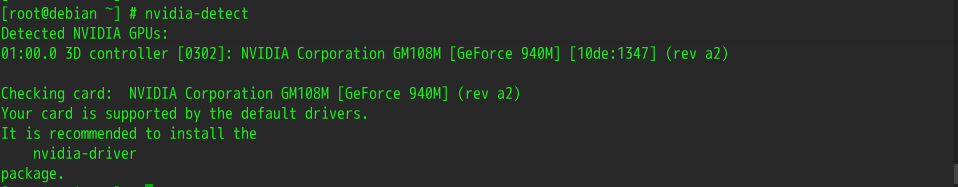

在这个 [网站](https://wiki.debian.org/NvidiaGraphicsDrivers) 可以找到支持的版本号，一般 Geforce 4xx 以上的 GPU 可以直接使用下面命令安装

```sh
apt-get install linux-headers-$(uname -r|sed 's/[^-]*-[^-]*-//')
apt-get install nvidia-driver
```

安装过程中有确认界面，直接回车即可。

安装完成之后重启计算机。

### 安装nvidia-docker

[github地址](https://github.com/NVIDIA/nvidia-docker)

配置 apt 源地址

```sh
curl -s -L https://nvidia.github.io/nvidia-docker/gpgkey | \
  apt-key add -
distribution=$(. /etc/os-release;echo $ID$VERSION_ID)
curl -s -L https://nvidia.github.io/nvidia-docker/$distribution/nvidia-docker.list | \
  tee /etc/apt/sources.list.d/nvidia-docker.list
apt-get update
```

> 安装 nvidia-docker2 过程中会使用 /etc/docker/daemon.json 文件，如果有这个文件，建议备份一下，安装完成之后再补充

安装 nvidia-docker2 和重启 docker

```sh
apt-get install -y nvidia-docker2
pkill -SIGHUP dockerd
```

测试安装情况

```sh
docker run --runtime=nvidia --rm nvidia/cuda:9.0-base nvidia-smi
```

上述命令显示如下界面，说明安装成功

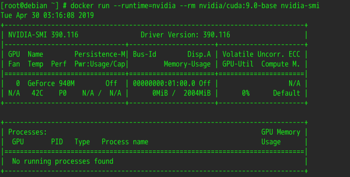

如果出现下面画面，是缺少安装包导致的

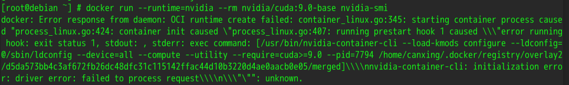

先使用 `nvidia-container-cli -k -d /dev/tty info` 查看错误信息

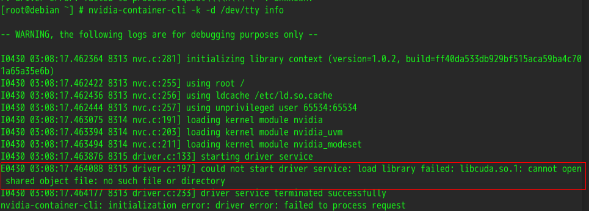

使用下面命令查看本地是否有没有这个库（这里缺少 libcuda.so.1 这个库，实际情况可能不同）

```sh
ldconfig -p | grep cuda
```

使用下面命令来查看库包含在哪个包中

```sh
dpkg -S /usr/lib/x86_64-linux-gnu/libcuda.so.1
```

我这里没有没有包含在任何包中，如果有上述命令有显示，直接使用 `apt install` 重新下载对应的包即可

使用 `apt search` 命令搜索 libcuda

```sh
[root@debian ~] # apt search libcuda
正在排序... 完成
全文搜索... 完成  
libcuda1/stable,stable,stable 390.116-1 amd64
  NVIDIA CUDA Driver Library

libcudart8.0/stable,stable,stable 8.0.44-4 amd64
  NVIDIA CUDA Runtime Library
```

下载 libcuda1 安装包之后运行成功


#### 卸载nvidia-docker

使用如下命令卸载

```sh
docker volume ls -q -f driver=nvidia-docker | xargs -r -I{} -n1 docker ps -q -a -f volume={} | xargs -r docker rm -f
apt-get purge -y nvidia-docker
```

### 安装Kubernetes环境

#### 初始化环境

使用 kubeadm 搭建 kubernetes 环境。

> 因为环境的原因，这里使用单节点演示，其他节点可以加入该节点组成 kubernetes 集群

关闭 Swap

```sh
swapoff -a
```

> 上述命令临时关闭 Swap，想要永久关闭 Swap，需要在 /etc/fstab 文件中找到 swap 那一行，使用 # 注释

使用阿里云的源

```sh
curl https://mirrors.aliyun.com/kubernetes/apt/doc/apt-key.gpg | apt-key add -

cat <<EOF > /etc/apt/sources.list.d/kubernetes.list
deb http://mirrors.aliyun.com/kubernetes/apt kubernetes-xenial main
EOF
```

安装 kubeadm, kubectl, kubelet

> 这里的安装方式默认安装最新的版本，目前（2019-05-05）最新的 kubeadm 版本是 1.14.1，如果有其他版本需求，可以使用 apt-cache madison kubeadm 查看版本并下载

```sh
apt-get update
apt-get install -y kubelet kubeadm kubectl
```

修改 kubelet 的 cgroup，kubelet 的 cgroup 需要和 docker 的 cgroup 一致。默认情况下 kubelet 的 cgroup 是 systemd，docker 的 cgroup 为 cgroupfs。使用下面命令在启动时将 kubelet 的 cgroup 修改为 cgroupfs。

```sh
echo `Environment="KUBELET_CGROUP_ARGS=--cgroup-driver=cgroupfs --pod-infra-container-image=registry.cn-hangzhou.aliyuncs.com/google_containers/pause-amd64:3.1"` >> /etc/systemd/system/kubelet.service.d/10-kubeadm.conf
```

重启 kubelet

```sh
systemctl daemon-reload
systemctl restart kubelet
```

#### 创建Master节点

kubeadm 初始化时会从远程仓库拉取镜像，国内需要借助厂商拉取再重新 tag，kubeadm 初始化需要的镜像可以通过下面命令查看

```sh
kubeadm config images list
```

此次安装所需要的镜像如下:

```
k8s.gcr.io/kube-apiserver:v1.14.1
k8s.gcr.io/kube-controller-manager:v1.14.1
k8s.gcr.io/kube-scheduler:v1.14.1
k8s.gcr.io/kube-proxy:v1.14.1
k8s.gcr.io/pause:3.1
k8s.gcr.io/etcd:3.3.10
k8s.gcr.io/coredns:1.3.1
```

使用 kubernetes dashboard 可以通过 web 操作 kubernetes，想要安装 kubernetes dashboard 也需要从国外仓库拉取镜像，这里放在一起重新 tag

> kubernetes dahboard 的镜像不一定是最新的，这里 [kubernetes-dashboard.yaml](https://raw.githubusercontent.com/kubernetes/dashboard/master/aio/deploy/recommended/kubernetes-dashboard.yaml) 可以看见 kubernetes dashboard 的编排文件

编写文件执行 `拉取--> tag` 操作

```sh
#! /bin/bash
images=(
  kube-apiserver:v1.14.1
  kube-controller-manager:v1.14.1
  kube-scheduler:v1.14.1
  kube-proxy:v1.14.1
  pause:3.1
  etcd:3.3.10
  coredns:1.3.1
  # kubernetes dashboard
  kubernetes-dashboard-amd64:v1.10.1
)
for imageName in ${images[@]} ; do
  docker pull registry.cn-hangzhou.aliyuncs.com/google_containers/$imageName
  docker tag registry.cn-hangzhou.aliyuncs.com/google_containers/$imageName k8s.gcr.io/$imageName
done
```

此次 kubernetes 环境使用 Calico 插件，更多的网络插件点击[这里](https://kubernetes.io/docs/setup/independent/create-cluster-kubeadm/#pod-network)查看。使用的命令如下：

```sh
kubeadm init --pod-network-cidr=192.168.0.0/16
```

安装成功后会有如下信息

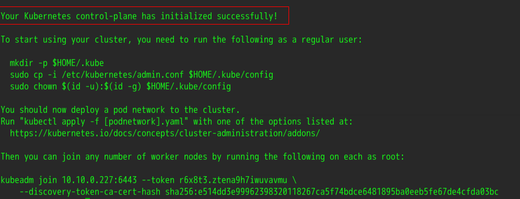

按照提示执行下面命令

```sh
mkdir -p $HOME/.kube
sudo cp -i /etc/kubernetes/admin.conf $HOME/.kube/config
sudo chown $(id -u):$(id -g) $HOME/.kube/config
```

接着安装网络插件，第一次执行会从远程仓库拉取镜像，启动较慢

```sh
kubectl apply -f https://docs.projectcalico.org/v3.5/getting-started/kubernetes/installation/hosted/etcd.yaml
kubectl apply -f https://docs.projectcalico.org/v3.5/getting-started/kubernetes/installation/hosted/calico.yaml
```

可以使用下面命令查看所有 Pod 的信息

```sh
kubectl get pods --all-namespaces
```

单节点安装还需要执行下面命令让 Master 节点参与调度

```sh
kubectl taint nodes <master-name> node-role.kubernetes.io/master:NoSchedule-
```

`<master-name>` 为单节点名称，使用 `kubectl get nodes` 可以查看。

#### 安装kubernetes-dashboad

如果需要 web UI 界面，使用下面命令安装

```sh
kubectl apply -f https://raw.githubusercontent.com/kubernetes/dashboard/master/aio/deploy/recommended/kubernetes-dashboard.yaml
```

默认情况下，kubernetes dashboard 的服务类型是 ClusterIP，因此不能被外部访问，想要被外部访问，可以将服务类型改为 NodePort，使用下面命令对 kubernetes-dashboard 服务进行编辑。

```sh
kubectl edit svc kubernetes-dashboard -n kube-system
```

修改为内容如下，主要是增加 nodePort 为 30000，修改 type 为 NodePort。

```yaml
....
spec:
  clusterIP: 10.96.64.130
  ports:
  - port: 443
    protocol: TCP
    targetPort: 8443
    nodePort: 30000
  selector:
    k8s-app: kubernetes-dashboard
  sessionAffinity: None
  type: NodePort
  ....
```

这里将服务暴露的端口固定为 30000，如果不指定，kubernetes 会随机暴露一个端口。固定的端口必须大于 30000。

接着就可以 `https://<your-master-ip>:30000` 连接在浏览器中访问。访问界面如下

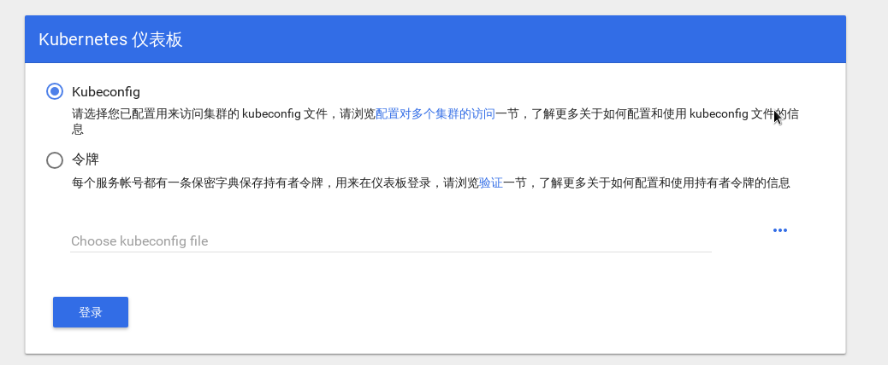

最新的 kubernetes dashboard 需要 token 才能访问，新建一个 kubernetes-admin.yaml 文件，在文件中写入下面内容

```yaml
apiVersion: v1
kind: ServiceAccount
metadata:
  name: admin-user
  namespace: kube-system
---
apiVersion: rbac.authorization.k8s.io/v1beta1
kind: ClusterRoleBinding
metadata:
  name: admin-user
roleRef:
  apiGroup: rbac.authorization.k8s.io
  kind: ClusterRole
  name: cluster-admin
subjects:
- kind: ServiceAccount
  name: admin-user
  namespace: kube-system
```

使用下面命令获取 token

```sh
kubectl apply -f kubernetes-admin.yaml
kubectl -n kube-system describe secret $(kubectl -n kube-system get secret | grep admin-user | awk '{print $1}') | grep token:
```

获取到的 token 如下

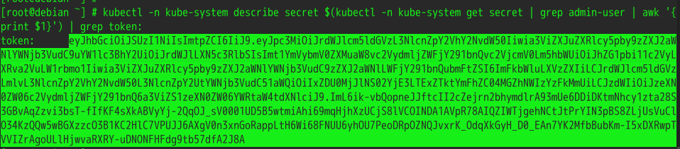

将 token 复制到令牌中即可访问

#### 加入集群

首先在 Master 节点上使用下面命令获取 token

```sh
kubeadm token list
```

如果没有，使用下面命令创建 token

```sh
kubeadm token create
```

接着在需要加入的节点上使用下面命令

```sh
hostnamectl set-hostname node1
kubeadm join --token <token> <master-ip> --discovery-token-unsafe-skip-ca-verification
```

#### 卸载

```sh
kubeadm reset
```

### 安装Nvidia插件

检查 `/etc/docker/daemon.json` 文件内容是否包含下面内容

```json
{
    "default-runtime": "nvidia",
    "runtimes": {
        "nvidia": {
            "path": "/usr/bin/nvidia-container-runtime",
            "runtimeArgs": []
        }
    }
}
```

如果修改了 `/etc/docker/daemon.json` 文件，使用 `systemctl restart docker` 重启 docker。

在 kubernetes 中启动 GPU 的支持

```sh
kubectl create -f https://raw.githubusercontent.com/NVIDIA/k8s-device-plugin/1.0.0-beta/nvidia-device-plugin.yml
```

安装完成之后，可以在节点上查看信息

```sh
kubectl describe nodes
```

输出如下:

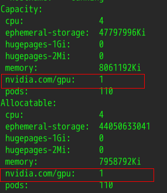

可以看见当前环境中可用 GPU 核心数量为 1 个

同样的命令，没有添加支持 GPU 的输出如下:

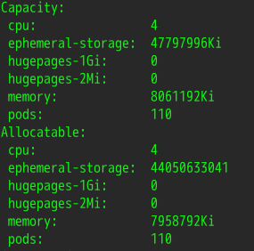

## 运行tensorflow

[参考文章](https://github.com/k8sp/k8s-tensorflow/tree/master/examples/k8s_gpu_tensorflow_dist)

由于时间以及硬件原因，实际运行和参考文章中的内容有所不同，不同之处有:

1. 参考文章中需要使用 2 个 GPU 核心，但是实际运行环境只有一个(GPU 核心数在上一节查看)
2. 当前(2019-05-05)kubernetes 1.14 中分配 GPU 使用 `nvidia.com/gpu`，参考文章中使用的是 `alpha.kubernetes.io/nvidia-gpu`
3. 参考文章中为 Pod 指定了 nodename，实际使用时去掉了 nodename

修改后的 yaml 文件可以在 `tensorflow-yaml` 文件夹中找到

想要按照参考文章中的示例运行，还需要准备训练数据，训练数据在 `tensorflow` 文件夹中。将 `tensorflow` 文件夹放在 `/root` 目录下，在 `tensorflow` 文件夹中执行 `pwd` 命令的输出应为 `/root/tensorflow`。

然后进入 `tensorflow-yaml` 文件夹，执行下面命令

```sh
kubectl create tensorflow
kubectl apply -f worker_ps_service_GPU.yaml -n tensorflow
kubectl apply -f worker_ps_rc_GPU.yaml -n tensorflow
```

可以通过 `kubectl get pods -n tensorflow` 命令查看 Pod 信息。该示例中，日志不能通过 `kubectl log` 查看，日志输出在 `/root/tensorflow/train_pa` 和 `/root/tensorflow/train_worker0` 两个文件夹中。

通过命令 `cat /root/tensorflow/train_worker0/log` 查看日志，输出如下:

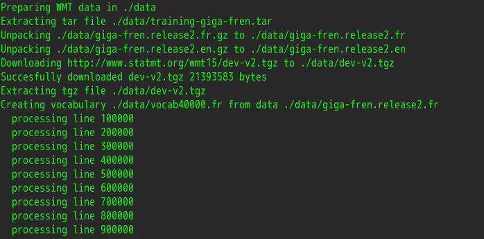

通过命令 `nvidia-smi` 可以查看显卡使用信息

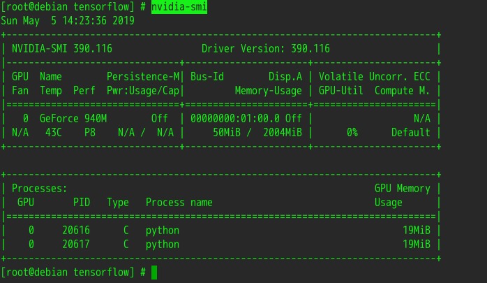

# 参考文章 

[debian 9 安装显卡驱动官方地址](https://wiki.debian.org/NvidiaGraphicsDrivers)

[debian 9 安装显卡驱动](https://www.cnblogs.com/hellxz/p/7865790.html)

[nvidia-docker](https://github.com/NVIDIA/nvidia-docker)

[kubernetes 单机部署](https://blog.codermi.com/post/k8s/%E5%8D%95%E6%9C%BA%E9%83%A8%E7%BD%B2kubernetes/)

[kubernetes-nvidia-plugin](https://github.com/NVIDIA/k8s-device-plugin)

[在 kubernetes 中使用 GPU 资源](https://bluesmilery.github.io/blogs/afcb1072/)

[kubernetes 上运行 tensorflow](https://github.com/k8sp/k8s-tensorflow/tree/master/examples/k8s_gpu_tensorflow_dist)
