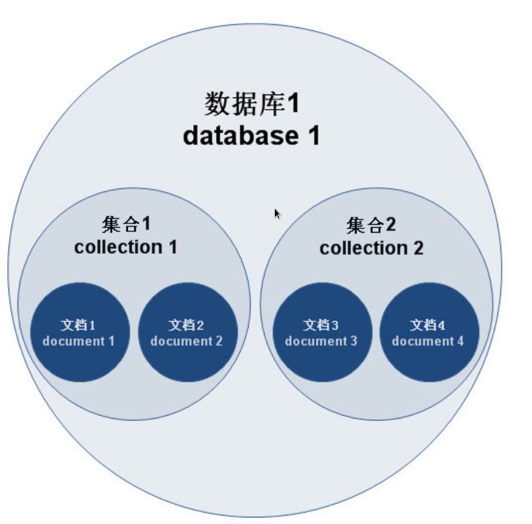
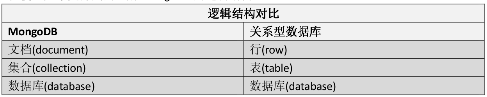

# MongoDB 学习记录

+ [什么是 MongoDB](#什么是MongoDB)
+ [MongoDB 的组织形式](#MongoDB的组织形式)
+ [MongoDB 有几种数据结构](#MongoDB有几种数据结构)
+ [如何创建数据库](#如何创建数据库)
+ [那么怎么样才可以创建集合](#那么怎么样才可以创建集合)
+ [如何删除集合和数据库](#如何删除集合和数据库)
+ [如何查看帮助文档](#如何查看帮助文档)
+ [如何插入文档](#如何插入文档)
  + [插入一条数据](#插入一条数据)
  + [插入多条数据](#插入多条数据)
+ [如何查询插入的数据](#如何查询插入的数据)
  + [查询全部数据](#查询全部数据)
  + [如何仅查询需要的字段](#如何仅查询需要的字段)
  + [如何根据条件进行查询](#如何根据条件进行查询)
  + [如何查询 `stars` 大于 50 的数据](#如何查询stars大于50的数据)
  + [如何多条件查询](#如何多条件查询)
  + [如何查询满足其中一个条件的数据](#如何查询满足其中一个条件的数据)
  + [如何按照 `stars` 从大到小，从小到大排序](#如何按照stars从大到小从小到大排序)
  + [如何实现分页](#如何实现分页)
  + [如何实现分组](#如何实现分组)
+ [如何删除数据](#如何删除数据)
  + [如何删除一条数据](#如何删除一条数据)
  + [如何删除多条数据](#如何删除多条数据)
+ [如何更新数据](#如何更新数据)
  + [如何更新一条数据](#如何更新一条数据)
  + [如何更新多条数据](#如何更新多条数据)
  + [如何更新数据中的文档数据](#如何更新数据中的文档数据)
    + [如何删除文档类型数据中的域](#如何删除文档类型数据中的域)
    + [如何在文档类型数据中插入新的数据](#如何在文档类型数据中插入新的数据)
  + [如何更新数组中的数据](#如何更新数组中的数据)
    + [如何往数组中插入新的数据](#如何往数组中插入新的数据)
    + [如何删除数组中的数据](#如何删除数组中的数据)
    + [如何向数组中插入另一个数组的内容](#如何向数组中插入另一个数组的内容)
    + [如何向数组中插入不重复数据](#如何向数组中插入不重复数据)
    + [如何删除数组中的多个元素](#如何删除数组中的多个元素)
  + [如何创建索引](#如何创建索引)
    + [创建升序索引](#创建升序索引)
    + [创建降序索引](#创建降序索引)
  + [如何查看创建索引](#如何查看创建索引)
  + [如何删除创建的索引](#如何删除创建的索引)

## 什么是MongoDB

MongoDB 是一个 NoSQL 数据库，和 MySQL 等关系型数据库不一样 MongoDB 更简单易用。MongoDB 是 NoSQL 的一种。

## MongoDB的组织形式

MongoDB 中可以有多个`数据库`，每个数据库中可以有多个`集合`，每个集合有多个`文档`（文档就相当于 MySQL 中的表，但是表中的数据都有相同的域，文档中的每一条数据不一定有相同的域），每个文档都有`域`，这些域可能存在也可能不存在，在实际使用中每个文档应该有相同的域。

MongoDB 的组织形式图解:  



MongoDB 和 MySQL 的对对比：  



## MongoDB有几种数据结构

MongoDB 中以下几种数据结构：

+ 数字
+ 字符串
+ 布尔
+ 日期
+ 数组
+ 文档（JavaScript 中的对象）

## 如何创建数据库

MongoDB 中的数据库不用手动创建，只需要使用 `use <collection>` 就可以选择数据库，如何没有这个数据库，在创建一个集合的同时也会创建数据库

## 那么怎么样才可以创建集合

使用以下命令就可以创建一个集合

```JavaScript
db.createCollection("collectionName")
```

## 如何删除集合和数据库

使用以下命令可以删除一个集合，其中 `<collection>` 表示选中的集合

```JavaScript
db.<collection>.drop()
```

删除数据库可以使用以下命令删除，注意，这个 db 是由 `use <database>` 选中的数据库

```javascript
db.dropDatabase()
```

## 如何查看帮助文档

在 Mongo shell 中直接使用 `help` 命令可以查看在线帮助文档

使用 `db.help()` 可以查看数据库相关的帮助文档

使用 `db.<collectionname>.help()` 可以查看数据库集合的相关帮助文档

## 如何插入文档

查看 `db.<collectionname>.help()` 可以看见 MongoDB 定义了三种方式来插入文档，有 `insert`,`insertOne`,`insertMany`，其中 `insert` 用处最多，具备有 `insertOne` 和 `insertMany` 的功能。

`insertOne` 用于向数据库中插入单条数据的情况，`insertMany` 用于一条命令向数据库中插入多条数据。

### 插入一条数据

```javascript
db.blog.insert({
    title: 'mongodb 的使用',
    author: 'canxing',
    publishDate: new Date(2018,7,16,17,31),
    content : 'mongodb 插入语句的实现',
    stars : 10,
    comment : []
})
```

### 插入多条数据

```javascript
db.blog.insert([
{
    title: 'mongodb 插入多条数据的使用',
    author: 'canxing',
    publishDate : new Date(2018,7,16,17,33),
    content : "mongodb 插入多条数据的实现",
    stars: 12,
    comment : []
},
{
    title: 'mongodb 插入多条数据的使用2',
    author:'canxing',
    publishDate: new Date(2018, 7, 16, 17, 34),
    content: "mongodb 插入多条数据的实现2",
    stars: 2,
    comment : []
}
])
```

## 如何查询插入的数据

首先保证数据库中已经插入了下面这些数据

```javascript
db.blog.insert([
    {
        title: 'mongodb 数据库的创建',
        author: {
            firstName: 'liu',
            lastName: 'xin'
        },
        publishDate: new Date(2018, 7, 20, 9, 12),
        content: 'mongodb 数据库的创建',
        stars: 30,
        comment:[
            'aaaa',
            'bbbb',
            'cccc'
        ]
    },
    {
        title: "走两步",
        author: {
            firstName: "tom",
            lastName: "jerry"
        },
        publishDate: new Date(2018, 7, 21, 8, 23),
        content: "随便走两步",
        stars: 32,
        comment: [
            'dddd',
            'eeee',
            'ffff'
        ]
    },
    {
        title: "葫芦娃救爷爷",
        author: {
            firstName: "忘了",
            lastName: "忘了"
        },
        publishDate: new Date(2018, 7, 22, 10, 23),
        content: "7个葫芦娃轮流救爷爷，结果都被抓了",
        stars: 11000,
        comment: [
            'gggggggggg',
            'hhhhhhhhhhh',
            'iiiiiiiiiii'
        ]
    }
])
```

### 查询全部数据

> 要想查询的结果可读性更强，可以试试 pretty 方法 db.blog.find().pretty()

```javascript
db.blog.find()
```

### 如何仅查询需要的字段

```javascript
db.blog.find({}, {title:1, author:1, publishDate:1, _id:1})
```

查询的第一个参数是筛选条件，`{}` 表示不过滤直接查询，也就是查询所有的数据，第二个参数设置需要显示的域，要显示的设置为 1, 不显示的设置为 0, `_id` 域默认显示，不想显示需要手动指定。

### 如何根据条件进行查询

```javascript
db.blog.find({title: "mongodb 数据库的创建"})  //根据博客名称进行查询
db.blog.find({author: {firstName: "liu", lastName: "xin"}})  //根据作者进行查询
db.blog.find({comment: 'dddd'})  //根据评论进行查询
```

上面展示了三种根据条件进行查询的方式，这种方式类似于 MySQL 中的 where 字句但是也有不同。

第一条查询语句使用 `{title: "mongodb 数据库的创建"}` 来筛选，返回所有数据中满足 `title` 域对应的值等于 `mongodb 数据库的创建` 的语句。

第二条查询语句使用 `{author: {firstName: "liu", lastName: "xin"}}` 来筛选，注意，这个 `author` 是一个文档类型，查询的时候需要该文档类型中的所有域都相等。

第三条查询语句使用 `{comment: 'dddd'}` 来筛选，`comment` 是一个数组类型，查询时可以使用这种方式，表示查询的数组中含有 `dddd` 元素的数据，也可以使用 `db.blog.find({comment: ["aaaa", "bbbb", "cccc"]})` 来查询，使用后一种方式时要使用匹配该数组中的所有元素才行。

### 如何查询stars大于 50 的数据

```javascript
db.blog.find({stars: {$gt: 50}})
```

在 MongoDB 中 `>`,`<`, 都不能使用，要使用特殊符号来表示这些。符号如下:

含义 | 表示
---- | ----
大于 | $gt
小于 | $lt
不等于 | $ne
大于等于 | $gte
小于等于 | $lte

用法和示例类似

### 如何多条件查询

```javascript
db.blog.find({stars: 32, title: "走两步"})
```

要查询同时满足多个条件的数据，只需要如示例添加条件就行了。

### 如何查询满足其中一个条件的数据

如果要求返回匹配多个条件中的一个条件的数据，需要使用关键字 `$or`，相当于 or 语句。

```javascript
db.blog.find({$or: [{stars: 32}, {stars: 30}]})
```

### 如何按照stars从大到小从小到大排序

```javascript
db.blog.find({}).sort({stars:1})  //升序
db.blog.find({}).sort({stars:-1}) //降序
```

### 如何实现分页

MongoDB 中也有 limit 方法，但是这个 limit 和 MySQL 中的 limit 不同，这个 limit 只会返回指定条数的数据，不能指定从什么位置开始读取。要实现和 MySQL 中的 limit 相同的功能，需要同时使用 skip 和 limit。

```javascript
db.blog.find({}).skip(1).limit(1)
```

skip 表示跳过多条数据，limit 表示只读取多条数据，这里跳过第一条，只读取一条，那么就会读取所有数据的第二条。

### 如何实现分组

在 MySQL 中，分组首先要有一个字段，按照这个字段的不同分成不同的组。MongoDB 中也是一样，需要某一个域作为参数，返回这个参数的不同的值。

分组要 `aggregate` 方法和 `$group` 操作符，在 `$group` 操作符中，使用 `_id` 来说明分组的 key 。

```javascript
db.blog.aggregate([{$group: {_id:'$stars'}}]) //按照 stars 字段进行分组
```

## 如何删除数据

删除数据可以使用 `remove`,`deleteOne` 和 `deleteMany` 中的某一个。

### 如何删除一条数据

如果只想删除一条数据，使用 `deleteOne`，它会删除满足条件的第一条语句。

```javascript
db.blog.deleteOne({title: "mongodb 数据库的创建"})
```

### 如何删除多条数据

删除多条数据使用 `deleteMany` 是很不错的。

```javascript
db.blog.deleteMany({stars: {$gt: 30}})
```

删除单条数据使用 `deleteOne`，删除多条数据使用 `deleteMany`，至于 `remove` 一般情况下不需要使用，毕竟 `deleteMany` 既可以删除一条也可以删除多条。

## 如何更新数据

更新数据使用 `update`,`updateOne` 和 `updateMany`。

### 如何更新一条数据

更新一条数据使用 `updateOne` 方法，`updateOne` 方法会更新第一个匹配的数据。

```javascript
db.blog.updateOne({title: "mongodb 数据库的创建"}, {$set: {stars: 50}})
```

`updateOne` 接收两个参数，第一个参数是要修改数据的查询条件，和查询时使用的条件一样，第二个参数表示要更新的数据。* 注意 *：如果没有使用 `$set` 那么这条数据就只有一个域那就是 `{stars:50}`，使用 `$set` 之后才会修改指定的域，不然就是覆盖整条数据。

### 如何更新多条数据

更新多条数据使用 `updateMany`，使用 `update` 也可以，可是使用 `update` 需要额外添加 `{multi: true}`，有些时候会忘记添加，忘记添加就相当于使用 `updateOne`。

```javascript
 db.blog.updateMany({$or: [{title: "mongodb 数据库的创建"}, {title: "走两步"}]}, {$set: {stars: 1000}})
```

### 如何更新数据中的文档数据

在我们插入的数据中有 `author` 域，该域是一个文档类型，和普通数据类型不同，如何修改，删除，添加里面的数据

#### 如何删除文档类型数据中的域

```javascript
db.blog.updateOne({title: "mongodb 数据库的创建"}, {$unset: {'author.lastName': 1}})
```

这里使用了 `$unset`，这个操作会删除一个域，`'author.lastName'` 表示 `author` 文档的 `lastName` 属性，1 表示删除。`$unset` 不仅可以删除一个文档中的域，也可以删除一个域。

#### 如何在文档类型数据中插入新的数据

```javascript
db.blog.updateOne({title: "mongodb 数据库的创建"}, {$set: {'author.lastName': 'xin'}})
```

上述操作不仅可以插入新的数据，也可以用来更新数据

### 如何更新数组中的数据

和数组有关的操作符看[这里](https://docs.mongodb.com/manual/reference/operator/update-array/)

#### 如何往数组中插入新的数据

往数组中插入新的数据使用 `$push` 操作符

```javascript
db.blog.updateOne({title: "mongodb 数据库的创建"}, {$push: {comment: 'zzzzzzzzzz'}})
```

#### 如何删除数组中的数据

删除数组中的数据使用 `$pop` 操作符和 `$pull` 操作符。`$pop` 操作符用于删除并返回数组中的第一个或最后一个元素。`$pull` 操作符用于精确删除数组中匹配的数据。

```javascript
db.blog.updateOne({title: "mongodb 数据库的创建"}, {$pop:{comment:1}})
```

其中 `{comment: 1}` 中的 1 表示弹出并删除最后一个元素

```javascript
db.blog.updateOne({title:"mongodb 数据库的创建"}, {$pull: {comment: 'bbbb'}})
```

#### 如何向数组中插入另一个数组的内容

如果直接使用 `$push` 向数组中插入一个数组的话，都将数组作为一个元素插入，而不是将数组中的所有元素依次插入。

为了将一个数组中的所有元素都插入到数组中，需要使用 `$each` 关键字。

```javascript
db.blog.updateOne({title:"mongodb 数据库的创建"}, {$push: {comment: {$each: [1, 2, 3, 4, 5]}}});
```

#### 如何向数组中插入不重复数据

mongodb 没有提供编程语言中集合类型相似的数据结构，只有数组，为了不插入重复数据，可以使用 `$addToSet` 关键字，或者在输出的时候去重。

```javascirpt
db.log.updateOne({title: "mongodb 数据库的创建"}, {$addToPush: {comment: {$each: [7, 7, 7, 7]}}});
```

#### 如何删除数组中的多个元素

只使用 `$pusll` 关键字无法删除数组中的多个元素，只能删除一个元素，要删除多个使用 `$in` 关键字。

```javascript
db.blog.updateOne({titile: "mongodb 数据库的创建"}, {$pull : {comment: {$in: [1, 2, 3, 4, 5]}}});
```

## 如何创建索引

使用文档中某个域创建索引，使用该域进行查询时可以加快查询速度

### 创建升序索引

```javascript
db.blog.createIndex({title:1})
```

### 创建降序索引

```javascript
db.blog.createIndex({title:-1})
```

## 如何查看创建索引

```javascript
db.blog.getIndexes()
```

## 如何删除创建的索引

删除对应索引，删除索引时的名称不是创建索引时的名称，而是使用 `getIndexes` 查看的 `name` 属性的名称

```javascript
db.blog.dropIndex('title_1')
```
