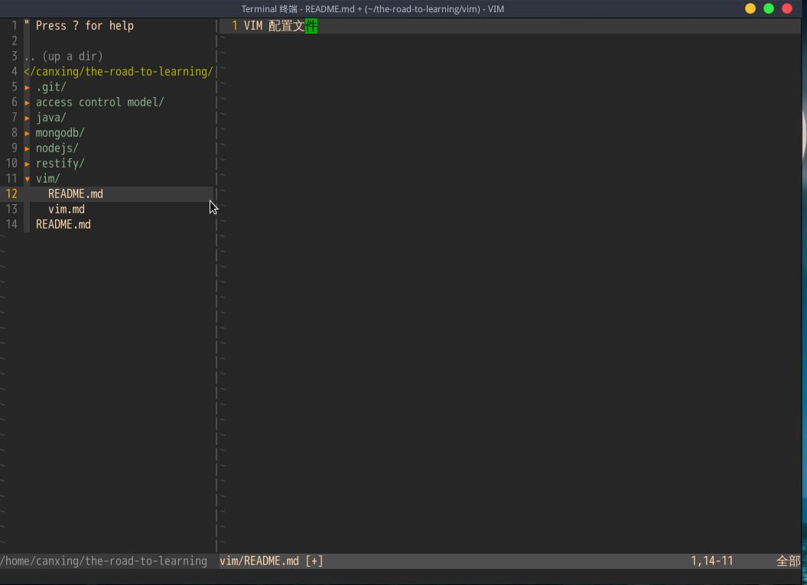

VIM 配置

这个配置比较简单，只有有限的几个插件，涉及少数几个 VIM 命令，不同于其他 VIM 成熟的配置，如果你需要的是一个成熟的 VIM 配置，那么你应该去别的地方找找，如果你只需要一份简单的配置以便与后续的自定义，这个说不定就是你想要的。

VIM 显示界面

上述 VIM 样式是终端 VIM，对于 GUI VIM 也有一定的效果，但是不一定完全一样。

VIM 配置包括两部分，一部分是 VIM 插件，一部分 VIM 配置文件。

VIM 插件集中在 bundle 目录下，bundle 应该放在 `~/.vim/` 目录下，对于 windows 用户需要自行搜索插件存放目录。

VIM 配置文件 `.vimrc` 应该放在用户的根目录下，用于启动 VIM 时加载。

VIM 配置使用了以下几个插件

+ Vundle 用于管理其他插件的插件
+ nerdtree 用于在 VIM 中显示目录树的插件 
+ gruvbox VIM 的主题插件
+ tabular 和 vim-markdown 是让 VIM 可以支持 Markdonw 的插件
