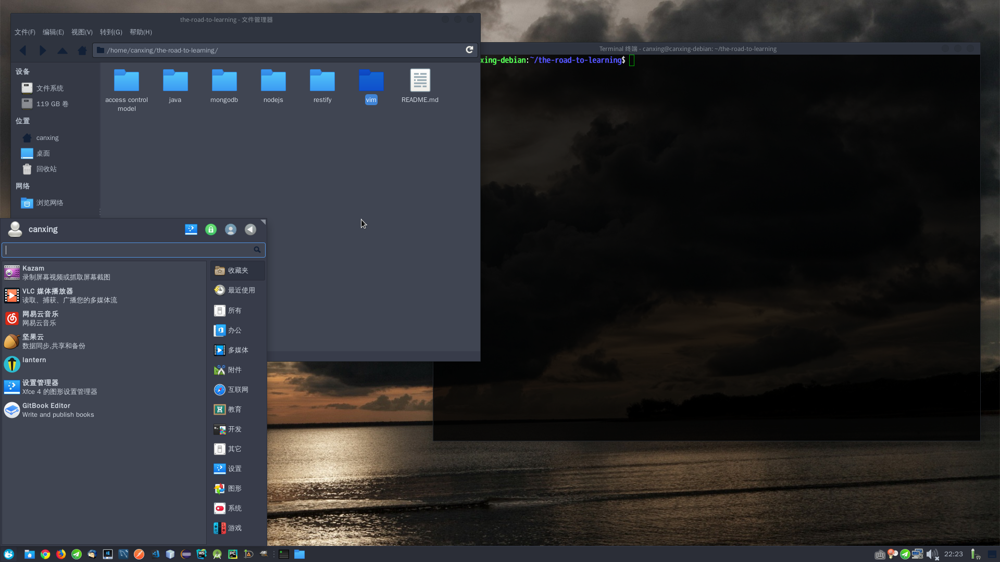

# xfce4 桌面环境美化

先上图

一个好的桌面环境无外乎高清壁纸，主题以及合适的图标。

高清壁纸点[这里](http://wallpaperswide.com/top_wallpapers.html)

主题可以从[这里](https://www.xfce-look.org)找，不光是 xfce 的主题还有其他桌面环境的主题。

图片上的主题和图片可以从当前目录下的 `theme` 目录下找到。

主题解压之后放到 `/usr/share/themes` 文件下即可在设置中选择主题

图标文件解压后放到 `/usr/share/icons` 文件下即可在设置中选择。

对于详细说明请看[这里](https://wiki.xfce.org/zh-cn/howto/install_new_themes)

一款有趣的桌面软件：[redshift](https://github.com/jonls/redshift)，redshift 可以根据时间启动夜间模式，在一定程度上保护视力。

`apt` 管理工具使用 `apt install redshift` 或者 `apt install redshift-gtk` 下载。前者只提供命令行，后者额外提供了一个桌面工具方便开起和关闭。

